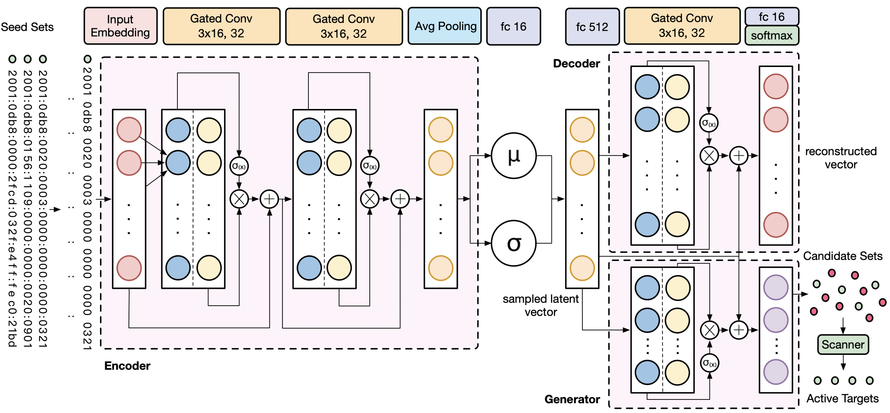

# 6GCVAE

**The repository of 6GCVAE, a deep learning architecture to achieve IPv6 target generation.**

6GCVAE stacks the **gated convolutional layer** to construct **VAE model**. The training model expects the generated address to be constantly approaching the input address to produce a new possible active target. To achieve the goal, the model is required to **learn the distribution of the input by an encoder, sample latent vector and reconstruct the new generation by a decoder**.



The work is introduced in the 24th Pacific-Asia Conference on Knowledge Discovery and Data Mining (PAKDD 2020):

> Tianyu Cui, Gaopeng Gou, Gang Xiong. 6GCVAE: Gated Convolutional Variational Autoencoder for IPv6 Target Generation. PAKDD 2020: 609-622

## Requirements

* Python 3
* [TensorFlow](https://www.tensorflow.org/install/) (1.0 or later)
* [Keras](https://keras.io/) (2.2.4)
* [scikit-learn](http://scikit-learn.org/stable/)

## Data

[IPv6 Hitlist](https://ipv6hitlist.github.io/) provides an IPv6 Hitlist Service to publish **responsive IPv6 addresses, aliased prefixes, and non-aliased prefixes** to interested researchers, which could be used as the seed addresses of target generation algorithms like 6GCVAE.

To use the seed dataset, please specify the `gasser_ipv6hitlist` path in `data_process.py` and run :

```shell
python data_process.py
```

## Run

```shell
python gcnn_vae.py
```

## Target Generation

To generate the candidate set after model training, please run :

```shell
python generation.py
```

## Cite

If the code is helpful in your work, please cite our paper:

```
@inproceedings{cui20206gcvae,
  title={6GCVAE: Gated Convolutional Variational Autoencoder for IPv6 Target Generation},
  author={Cui, Tianyu and Gou, Gaopeng and Xiong, Gang},
  booktitle={Advances in Knowledge Discovery and Data Mining - 24th Pacific-Asia Conference, {PAKDD} 2020},
  pages={609--622},
  year={2020}
}
```